## 详细步骤
### 一、注册飞书应用
* url:https://open.feishu.cn/app?lang=zh-CN

  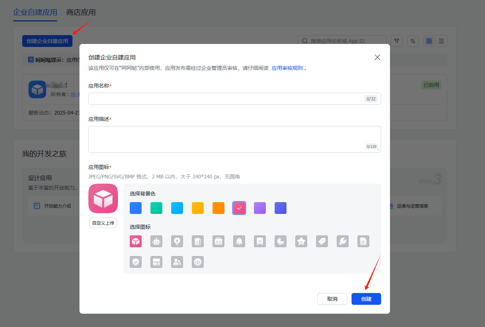
### 二、为应用添加权限
创建飞书应用完成后，我们需要为该应用添加飞书文档相关的权限，让应用拥有访问创建文档相关的能力
#### 1. 点击我们第一步创建的应用
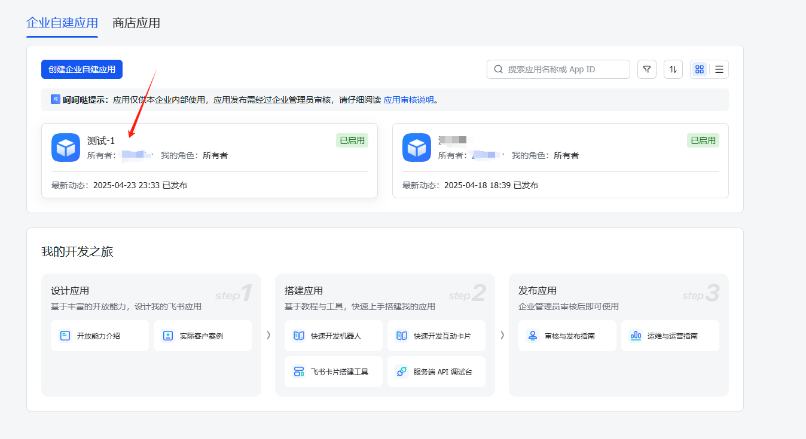
#### 2. 导入权限
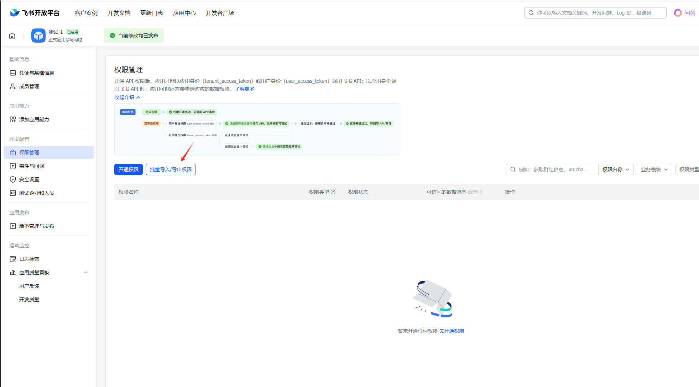   
全下如下
```
{
  "scopes": {
    "tenant": [
      "docx:document.block:convert",
      "base:app:read",
      "bitable:app",
      "bitable:app:readonly",
      "board:whiteboard:node:read",
      "contact:user.employee_id:readonly",
      "docs:document.content:read",
      "docx:document",
      "docx:document:create",
      "docx:document:readonly",
      "drive:drive",
      "drive:drive:readonly",
      "drive:file",
      "drive:file:upload",
      "sheets:spreadsheet",
      "sheets:spreadsheet:readonly",
      "space:document:retrieve",
      "space:folder:create",
      "wiki:space:read",
      "wiki:space:retrieve",
      "wiki:wiki",
      "wiki:wiki:readonly"
    ],
    "user": [
      "docx:document.block:convert",
      "base:app:read",
      "bitable:app",
      "bitable:app:readonly",
      "board:whiteboard:node:read",
      "contact:user.employee_id:readonly",
      "docs:document.content:read",
      "docx:document",
      "docx:document:create",
      "docx:document:readonly",
      "drive:drive",
      "drive:drive:readonly",
      "drive:file",
      "drive:file:upload",
      "sheets:spreadsheet",
      "sheets:spreadsheet:readonly",
      "space:document:retrieve",
      "space:folder:create",
      "wiki:space:read",
      "wiki:space:retrieve",
      "wiki:wiki",
      "wiki:wiki:readonly",
      "offline_access"
    ]
  }
}
```
#### 3. 发布审批应用（注：**可用范围选择全部**）
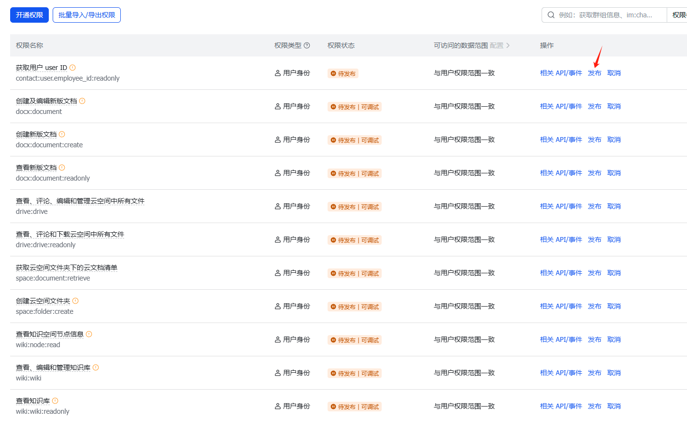
#### 4. 等待管理员审批通过
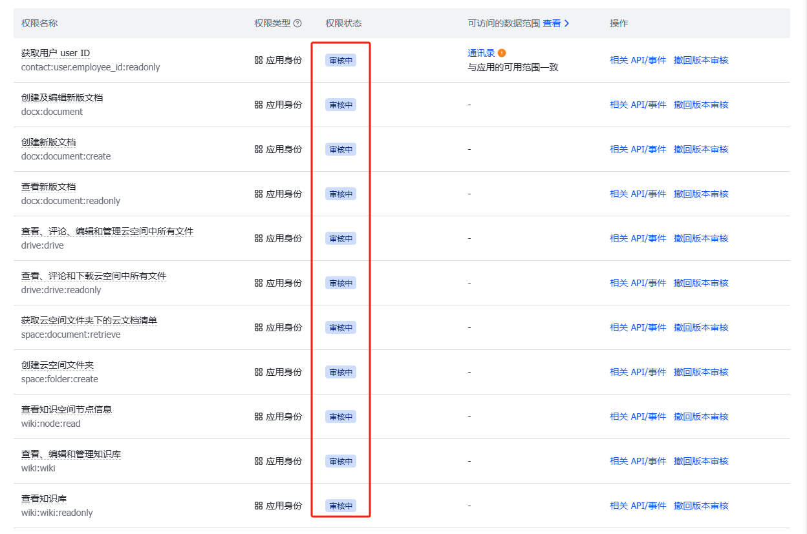

### 三、为应用添加访问文件的权限
要添加应用为文档协作者，主要有以下两种方式：
#### 方式一：直接添加应用为云文档的协作者(作用于单个文档)
该方式要求操作者为云文档所有者、拥有文档管理权限的协作者或知识库管理员。操作者可通过云文档网页页面右上方「...」->「...更多」-> 「添加文档应用」入口添加。
> 1. 在 添加文档应用 前，你需确保发布版本的[可用范围](https://open.feishu.cn/document/develop-process/test-and-release-app/availability)包含节点云文档的所有者。否则你将无法在文档应用窗口搜索到目标应用。
> 2. 在 添加文档应用 前，你需确保目标应用至少开通了任意一个云文档 [API 权限](https://open.feishu.cn/document/server-docs/application-scope/scope-list)。否则你将无法在文档应用窗口搜索到目标应用。

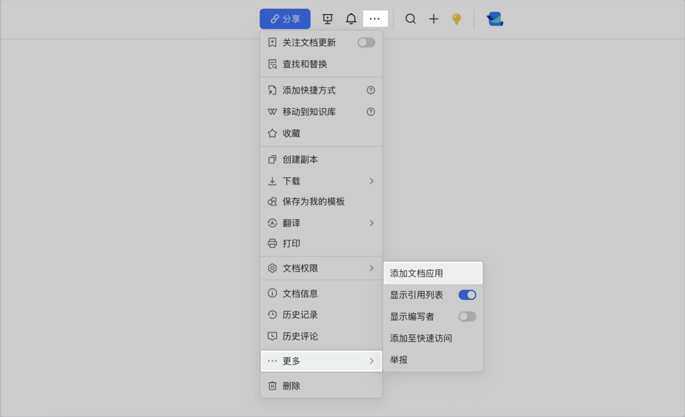

#### 方式二：添加包含应用的群组为云文档资源的协作者
#### 1. 访问[开发者后台](https://open.feishu.cn/app)，选择目标应用

#### 2. 在应用管理页面，点击添加应用能力，找到机器人卡片，点击 +添加。
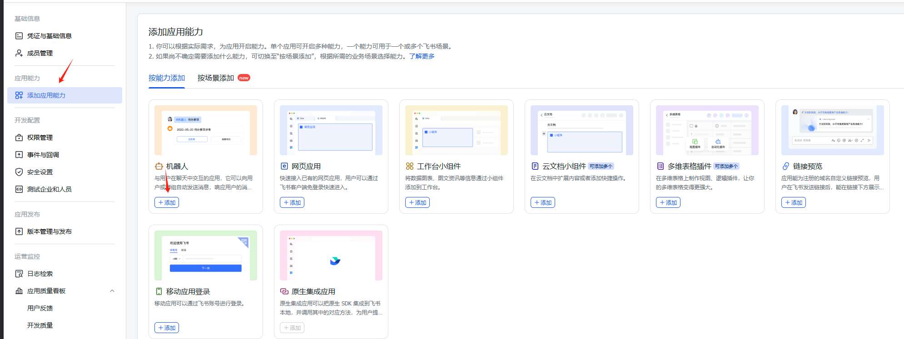

#### 3. 发布当前应用版本，并确保发布版本的可用范围包含云文档资源的所有者。
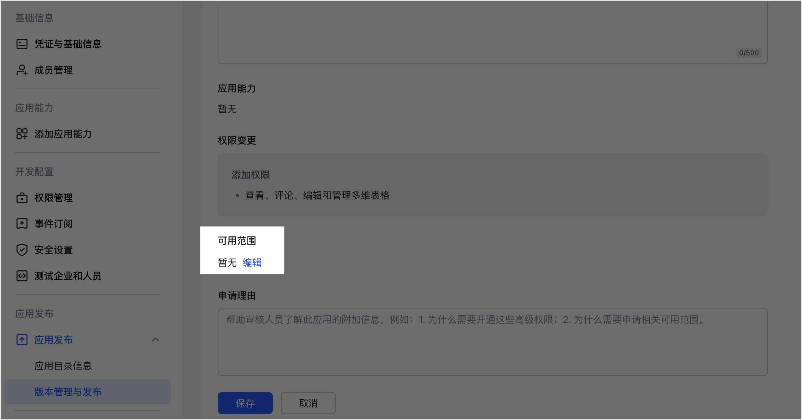
注：每次发布都需要管理员审核通过

#### 4. 在飞书客户端，创建一个新的群组，将应用添加为群机器人。
>注意 此处要添加应用作为机器人，而不是添加“自定义机器人”。

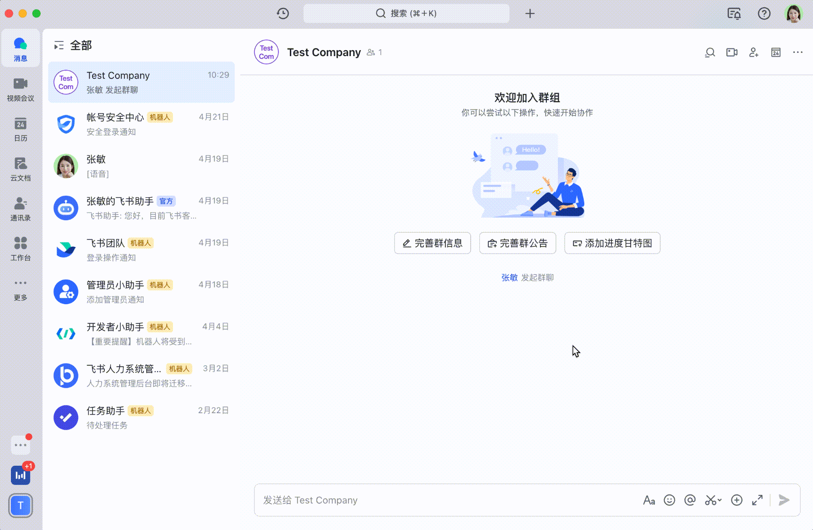

注：如果找不到应用，可以排查下上面第三条

#### 5. 在目标云文档页面的 分享 入口，邀请刚刚新建的群组作为协作者，并设置权限。
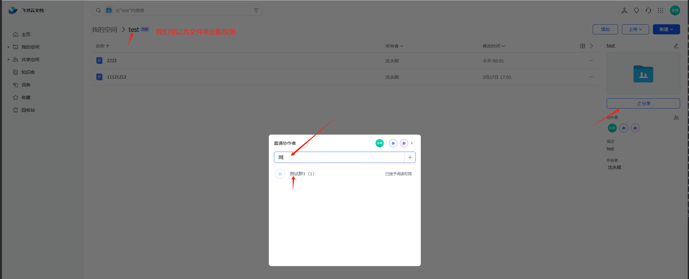

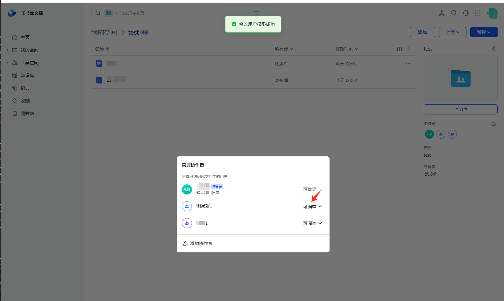

### 四、添加redirect_uri回调地址:http://localhost:3333/callback (3333为mcp server默认端口)
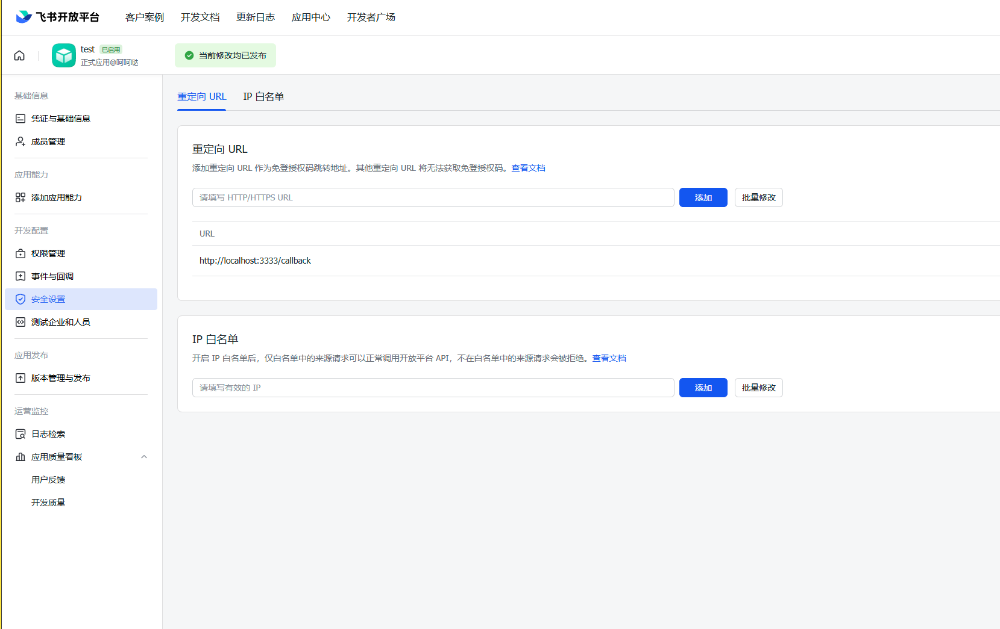

### 五、查看应用app Id与app Secret 
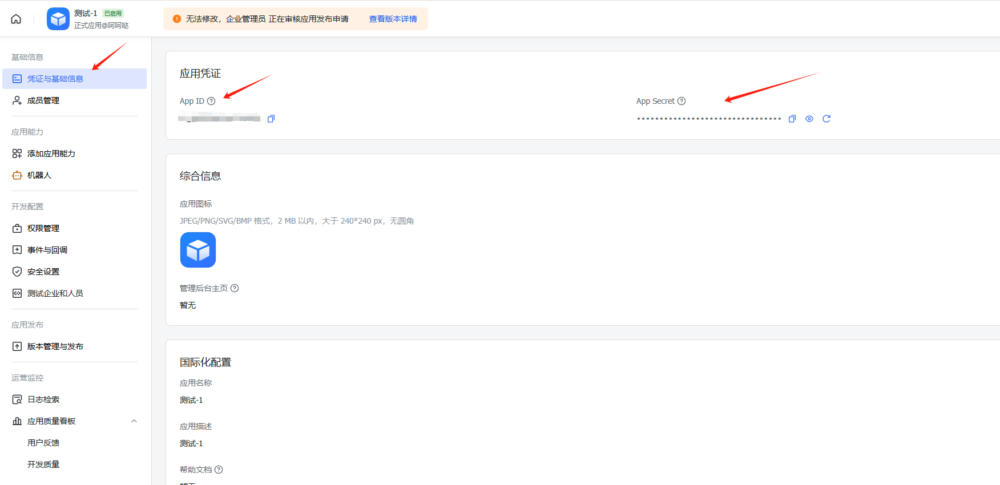

### 六、注
1. 具体可参见[官方云文档常见问题](https://open.feishu.cn/document/server-docs/docs/faq)
1. 具体可参见[知识库常见问题](https://open.feishu.cn/document/server-docs/docs/wiki-v2/wiki-qa)
